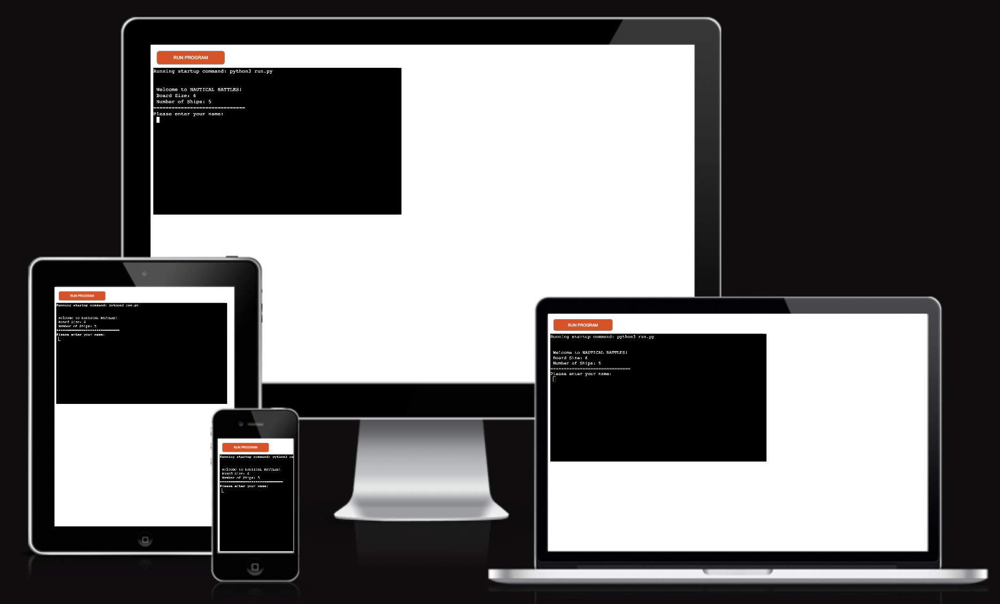
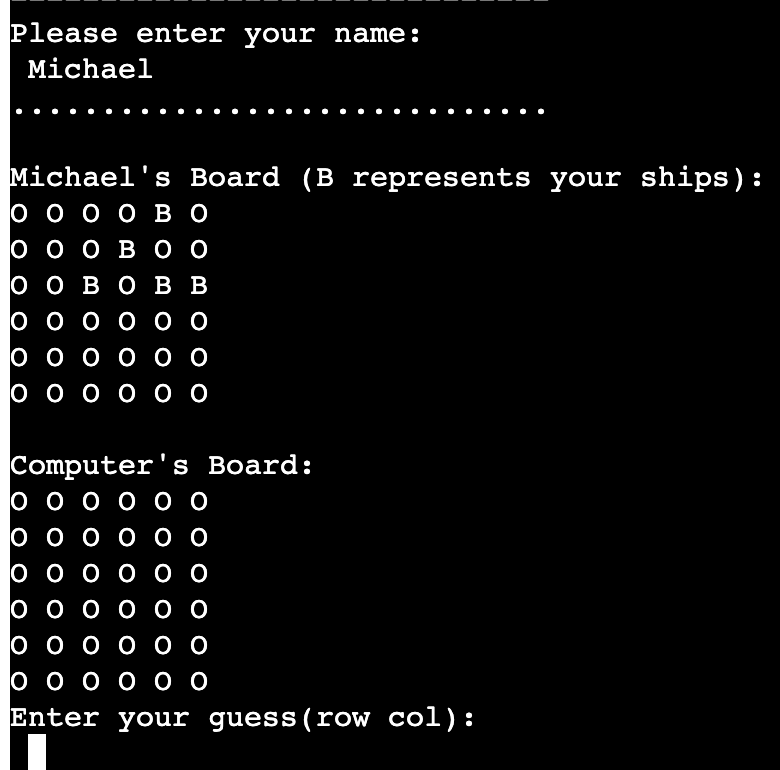
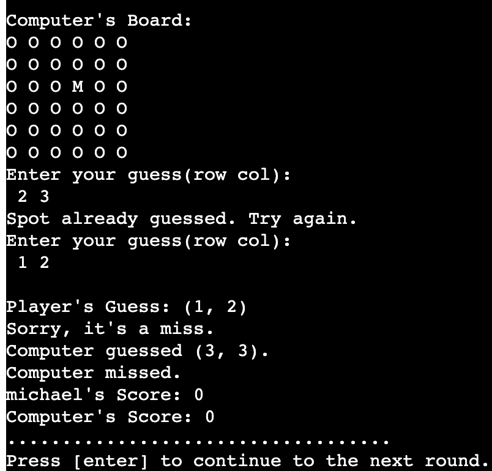
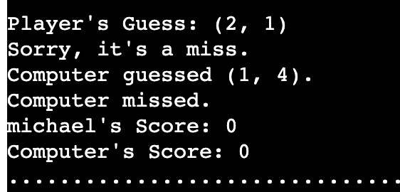
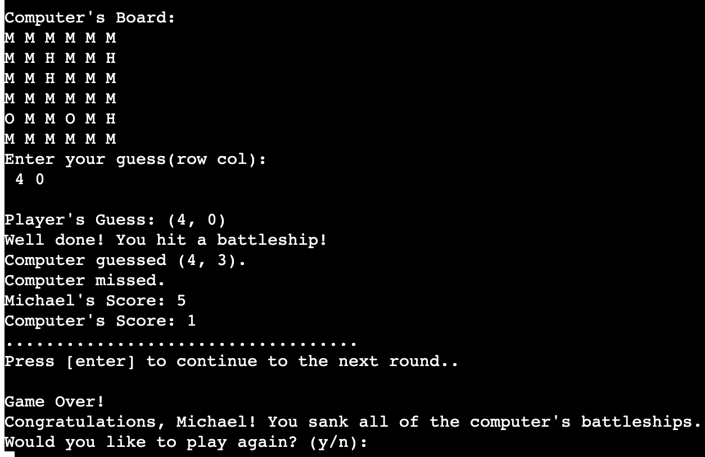
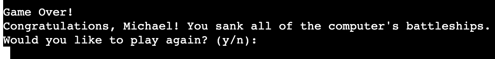
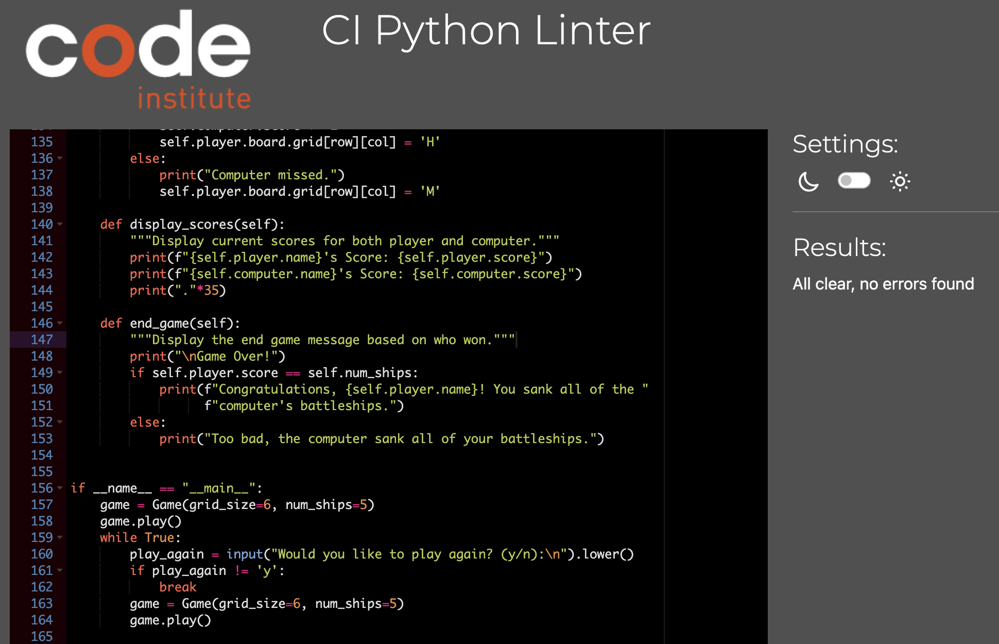

# **Nautical Battles**: A Classic Battleship Game

[Here is the live version of my project](https://nautical-battles-d6d9e6d6cff7.herokuapp.com/)

---

## **Table of Contents**
1. [Introduction](#introduction)
2. [Features](#features)
3. [Game Legends](#legends)
4. [How to Play](#how-to-play)
5. [Technical Details](#technical-details)
6. [Future Improvements](#future-improvements)
7. [Testing](#testing)
8. [Bugs](#bugs)
9. [Validator Testing](#validator-testing)
10. [Acknowledgements](#acknowledgements)
---
## **Introduction**
Nautical Battles is a modern reimagining of the classic board game "Battleship." Engage in a strategic duel against a computer opponent, placing your ships and then taking turns guessing where the enemy has hidden theirs. Will you emerge victorious?

---
## **Features**
1. **Game Initialisation**:
    - Welcome message introducing the player to "Nautical Battles". 
    - Boards are set to a fixed size, and a fixed number of ships are placed.
    - Player specifies their name.

    

2. **Dynamic Game Boards**:
    - Two types of boards: one for the player and one for the computer.
    - The board displays 'O' for water/empty spaces, 'B' for battleships, 'H' for hits, and 'M' for misses..
    - During the game, the player's board displays all ship placements, while the computer's board hides the ships.

    

3. **Game Turns**:
   **Player Turn**:
    - Players input their guess as row and column coordinates.
    - Players cannot guess the same spot more than once.
    - Player is prompted to hit enter to continue.
    - **Computer Turn**:
    - The computer randomly guesses a spot on the player's board.

    

4. **Scoring and Feedback System**:
    - Players receive immediate feedback after each guess, informing them if they've hit a battleship or not.
    - The computer's guesses and results are also displayed for the player to see.
    - Players receive a point for each successful hit.
    - Current scores for both the player and computer are displayed after each turn.

    

5. **Game End Conditions**:
    - The game ends when either the player or computer sinks all of the opponent's ships.
    - A congratulatory or consolation message is displayed depending on the outcome.
    
    

6. **Replay Option**:
    - Can't get enough? You can instantly start a new game after finishing! players have the option to play again or exit. 

    

    ---

## **Game Legends**

- `O`: Unguessed cell (Water)
- `B`: Your Battleship
- `H`: Hit
- `M`: Miss.
---

## **How to Play**
1. **Initialisation**
  - Upon launching, the game will display a welcome message, the board size and the number of ships available.
  - You'll be prompted to enter your name, which will personalise your game board with your battleships placed..
2. **Placing Ships**
  - Ships are automatically and randomly placed on the board for both the player and the computer.
3. **Making a Guess**: You'll be prompted to guess the location (row and column) of the computer's ships on its board.
  - If the guess is correct (i.e., it hits a ship), it's marked as 'H' for "hit". If the guess is incorrect, it's marked as 'M' for "miss".
4. **Computer's Turn**: Watch out! After your guess, the computer will take its turn. You'll be informed of the computer's guess and whether it was a hit or miss.

5. **Scoring**: After each round, the scores are updated. The first to sink all of the opponent's ships wins!

6. **Play Again?**: You can choose to play again or quit.

---

## **Technical Details**
### **1. Programming Language**
- **Python:** The game is entirely written in Python, a versatile and widely-used programming language.

### **2. Game Architecture**

#### **Board Class**

- **Attributes:** Maintains a 2D list representing the grid, and the size of the grid.
- **Key Methods:** 
  - `display()`: Displays the current board. Can hide or show ships based on the `hide_ships` parameter.
  - `place_ships()`: Randomly places a specified number of ships on the board.
  - `valid_guess()`: Validates if a given guess is within the board boundaries.

#### **Player and ComputerPlayer Classes**

- **Attributes:** Both classes maintain information about the player/computer, such as their name, score, board, and the set of their previous guesses.
- **Key Methods:** 
  - `make_guess()`: Allows the player/computer to make a guess on the opponent's board. The player's method accepts user input, while the computer's method generates random guesses.

#### **Game Class**

- **Attributes:** Maintains the game state, including player and computer boards, grid size, number of ships, and player and computer instances.
- **Key Methods:** 
  - `play()`: Initiates the game loop where players take turns to guess until all ships of one player are sunk.
  - `player_turn()` & `computer_turn()`: Handles turns for the player and computer respectively.
  - `display_boards()`: Displays both the player's and computer's boards.
  - `display_scores()`: Prints the current scores for both the player and computer.
  - `end_game()`: Ends the game and displays a message based on the result.

---

## **Future Improvements**
- **Multiple Difficulty Levels**: Introduce various difficulty levels for the computer opponent.
- **Customisable Board Size**: Let players choose the size of the board and the number of ships.
- **Two-Player Mode**: Enable a two-player mode for player vs. player battles.

---

## **Testing**
Thorough testing was a crucial part of the development process for this project. I did the following:
- Passed the final code through CI PEP8 linter and confirmed there are no problems
- Tested in Code institute Heroku terminal
- Given invalid input: strings when numbers are expected, out of bounds, same input twice.
- Special thanks to OpenAI and their model, ChatGPT, for aiding in the testing phase.
---

## **Bugs**
#### **Bugs Encountered**
1. **Visibility of Computer's Ships**: Initially, the computer's ships were represented by a '.', which made it easier for the player to guess their location. 

2. **Repetitive Guesses**: There was an issue where the player could guess the same coordinates multiple times. 

3.  **Feedback and Score Display Order**: The initial design of the game had feedback messages and scores spread out, which meant players had to scroll up to view them.

4. **Board Representation**: The 'B' character was used to represent both water and the player's ships, leading to some confusion.

#### **Bugs Solved**
1. **Visibility of Computer's Ships**: I modified the board's `display` method to ensure that when the board is being displayed with `hide_ships=True`, ships represented by `'B'` on the computer's board would be displayed as `'O'`, thus hiding them from the player.

2. **Repetitive Guesses**: I introduced a `guesses` set attribute for both the Player and ComputerPlayer classes. This set keeps track of all the coordinates that have already been guessed. Before allowing a guess, it is checked if it is already in the set. If so, the player was informed that the spot has already guessed and prompted to try again.

3. **Feedback and Score Display Order**: I rearranged the game flow within the `play` method of the `Game` class. After each turn (both player's and computer's), the respective guesses, feedback messages, and updated scores were displayed in a sequential and consolidated manner. This change ensured that all relevant information for a given round was presented together, offering a better user experience.

4. **Board Representation**: The board's `display` method was reviewed and ensured that ships on the player's board are represented by `'B'` and the water/empty spaces by `'O'`. The logic was adjusted to maintain this distinction and avoid any ambiguity.
---

## **Validator Testing**
- PEP8 CI Linter
    - All clear No errors were returned

---
## **Acknowledgments**
- Thanks to CI for their python essential template which provided all the files needed to run the mock terminal.
- Recieved invaluable assistance from CI tutor support
- Recieved invaluable insights and resources from my mentor
- Received insights and code enhancements from OpenAI's ChatGPT platform.

