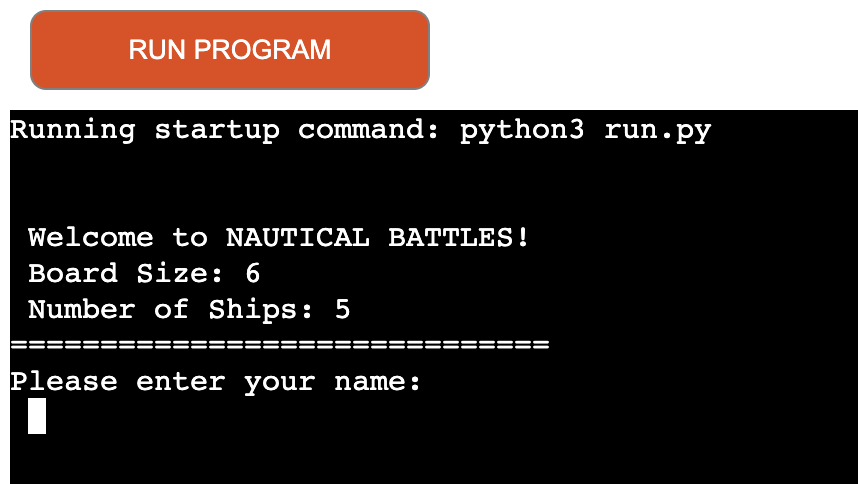

# **Nautical Battles**: A Classic Battleship Game

[Here is the live version of my project](https://nautical-battles-d6d9e6d6cff7.herokuapp.com/)

---
## **Introduction**
Nautical Battles is a modern reimagining of the classic board game "Battleship." Engage in a strategic duel against a computer opponent, placing your ships and then taking turns guessing where the enemy has hidden theirs. Will you emerge victorious?

---
## **Features**
1. **Game Initialisation**:
    - Welcome message introducing the player to "Nautical Battles". 
    - Boards are set to a fixed size, and a fixed number of ships are placed.
    - Player specifies their name.

    

2. **Dynamic Game Boards**:
    - Two types of boards: one for the player and one for the computer.
    - The board displays 'O' for water/empty spaces, 'B' for battleships, 'H' for hits, and 'M' for misses..
    - During the game, the player's board displays all ship placements, while the computer's board hides the ships.

    

3. **Game Turns**:
    - **Player Turn**:
        - Players input their guess as row and column coordinates.
        - Players cannot guess the same spot more than once.
        - Player is prompted to hit enter to continue.
    - **Computer Turn**:
        - The computer randomly guesses a spot on the player's board.

        

4. **Scoring and Feedback System**:
    - Players receive immediate feedback after each guess, informing them if they've hit a battleship or not.
    - The computer's guesses and results are also displayed for the player to see.
    - Players receive a point for each successful hit.
    - Current scores for both the player and computer are displayed after each turn.

    

5. **Game End Conditions**:
    - The game ends when either the player or computer sinks all of the opponent's ships.
    - A congratulatory or consolation message is displayed depending on the outcome.
    
    

6. **Replay Option**:
    - Can't get enough? You can instantly start a new game after finishing! players have the option to play again or exit. 

    

